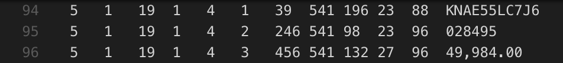

# Using Tesseract to convert PDF files to JSON

## Table of contents
- [Overview](#overview)
- [Prerequisites](#prereq)
- [Examples](#examples)
- [References](#references)

<div id='overview'/>

## Overview

When we try to pull information oout of PDF documents, users may end up pulling out both the plain text and images that are attached to the file. Since PDF files are not to be modified but all the information is usually transmitted, this can send unnesscarry data to an end user. In these cases, what if the user is only wanting to extract the plain-text from a PDF? The ability to lift plain -text out of a PDF includes using [OCR](https://docparser.com/blog/what-is-ocr/) or Optical Character Recognition. in this example, we use Tesseract for performing our OCR steps and convert the files over to a JSON format

<div id='prereq'/>

## Prerequisites:

**Note: Be sure that you have everything installed before continuing the project. Failure to have everything installed properly depending on your system can result in errors.**

 - [PiP](https://pip.pypa.io/en/stable/installing/)
 - [Tesseract](https://www.pyimagesearch.com/2017/07/03/installing-tesseract-for-ocr/)
 **Note: If you are using Windows, you'll have to [consult the Tesseract documentation]**(https://github.com/tesseract-ocr/tesseract/wiki#windows)
 - [ImageMagik](http://www.besavvy.com/documentation/4-5/Editor/031350_installimgk.htm)
 - [Ghostscript](https://www.ghostscript.com/doc/current/Install.htm)

#### If using macOS
Navigate to the modules folder by issuing the following command: 

```console
cd modules 
```

```console
curl https://bootstrap.pypa.io/get-pip.py -o get-pip.py

python get-pip.py --user
```

 - Installing Virtual Environment 
```console
pip install --user virtualenv
```

 - Initialize python3 in new virtual environment
```console
virtualenv -p python3 env
```

 - Activate environment  
```console
. env/bin/activate
```

### Mac OS install via brew
```console
brew install tesseract
brew install imagemagick
brew install gs
```

### Ubuntu/Linux install via apt
```console
sudo apt install tesseract-ocr
sudo apt install imagemagick
```

### Test tesseract, imagemagick, and gs installs by issuing the following commands:
```console
tesseract --version
convert -version # imagemagick version
gs --version # ghostscript version
```

<div id='examples'/>

## Examples

### Converting the example file (in this case we'll convert to tiff)
The command below will convert the example.pdf to a tiff file and place the output in ```out/tiff/out.tiff```.
```console
convert -density 300 pdf/example.pdf -depth 8 -strip -background white -alpha off out/tiff/out.tiff
```

### Limiting noise
Before we send the tiff file to tesseract we need to limit how much data is being passed in. We do this by cropping only the data we want into columns. These columns are then combined into one image file before being passed to tesseract for processing. When cropping the tiff we will convert the output to JPEG format which will further reduce the size.

**Tip: make sure to pad the filename with leading zeros so that the files enumerate in the correct order when we go to splice later on. ie: col1-%03d.jpeg**
```console
convert out/tiff/out.tiff -crop 400x2550+10+200 out/jpeg/col1-%03d.jpeg
convert out/tiff/out.tiff -crop 200x2550+1500+200 out/jpeg/col2-%03d.jpeg
convert out/jpeg/col1-004.jpeg out/jpeg/col2-004.jpeg +append out/jpeg/combined.jpeg

# resample image
convert -units PixelsPerInch out/jpeg/combined.jpeg -resample 300 out/jpeg/combined_300ppi.jpeg

```

### Run tesseract on file
```console
# run tesseract with custom parameters
# oem 1 (nerual nets LSTM only)
# psm 3 (page segmentation mode)  PSM_AUTO
# tsv file output to tab separated file
tesseract -l eng --oem 1 --psm 3 out/jpeg/combined_300ppi.jpeg out/tsv/result tsv
```

### Results
The following excerpt is from line 94-96 in out/tsv/result.tsv



### runtessrun script
Follow the instructions in the parsers README.md. Finally, modify the path labeled (TODO: Modify Path) so that the scripts reference the correct path.
```console
. runtessrun
```


### Python Script
Prior to running the main.py script navigate to the modules/parsers folder and set up the virtual environment.
Follow the instructions in the parsers README.md.
```console
. python main.py -i /Users/tylermeserve/Documents/Tesseract/tesseract/out/tsv -o /Users/tylermeserve/Documents/Tesseract/tesseract/out/json -t 156180205
```
Please be sure that -i is a direct path to the tsv files to parse, and -o is the direct path to put the json file. The -t parameter is the transactionid also known as an epoch time.

### Resources
#### https://github.com/tesseract-ocr/tesseract/wiki/Command-Line-Usage
#### https://github.com/tesseract-ocr/tesseract/wiki/TrainingTesseract-4.00
